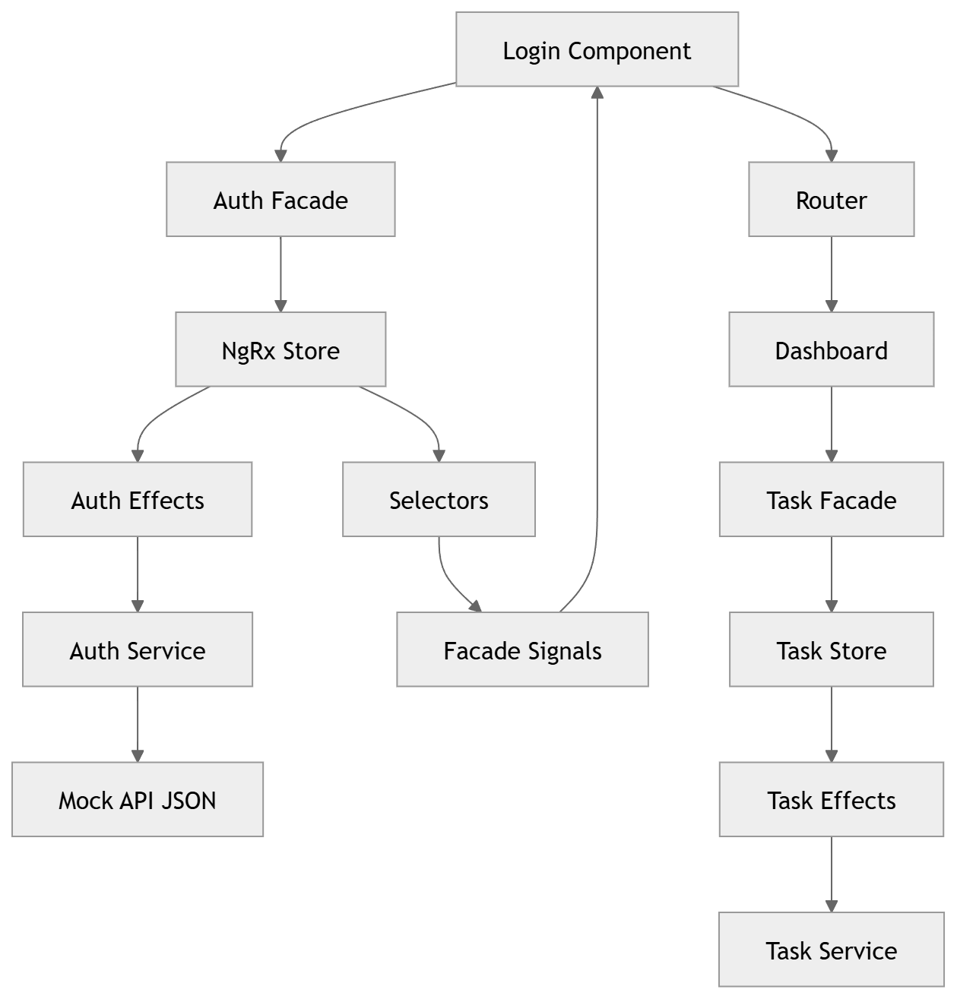

## 🧠 Architecture Diagram


# 🧾 Task Management Portal

## 📌 Overview
This project is a **Simple Task Management Portal** built using **Angular 21**, following modern best practices and scalable architecture.

The application includes:
- Authentication (Login)
- Responsive Dashboard
- Task Management (List, Detail, Create)
- Stepper-based Task Creation
- Toast Notifications

---

## 🚀 Tech Stack

- Angular 21 (Standalone Components)
- NgRx (Store, Effects, Facade Pattern)
- Angular Signals
- RxJS
- Angular Material UI

---

## 🧠 Architecture Highlights

- **SPA (Single Page Application)**
- **Feature-based modular structure**
- **Lazy-loaded routes**
- **Facade Pattern (decouples UI from NgRx)**
- **Signals for reactive UI**
- **Centralized HTTP handling**
- **Mock API using JSON**

---

## 🔐 Authentication

- Mock authentication using JSON data
- AuthGuard protects secured routes
- Redirects unauthenticated users to login

---

## 📊 Features Implemented

### ✅ Login
- Form validation
- Error handling
- Toast notifications

### ✅ Dashboard
- Responsive layout
- Navigation bar

### ✅ Task List
- Material table
- View & Edit actions

### ✅ Task Detail
- Image display
- Collapsible sections

### ✅ Task Creation
- Stepper (wizard)
- Validation
- Success notification

---

## 📦 Installation

```bash
npm install

▶️ Run Application
ng serve

Navigate to:
http://localhost:4200

🔑 Demo Credentials
Username: admin
Password: Admin@123

📁 Folder Structure
core/ → Services, guards, models
shared/ → Reusable UI components
store/ → NgRx state management
features/ → Feature modules (auth, tasks, dashboard)

⚡ Performance Considerations
OnPush change detection
Lazy loading
Signals instead of manual subscriptions
Clean state management via NgRx

⚡ Performance Considerations
OnPush change detection
Lazy loading
Signals instead of manual subscriptions
Clean state management via NgRx

📌 Notes

This project is designed with scalability, maintainability, and performance in mind, following enterprise-level Angular architecture.
:::